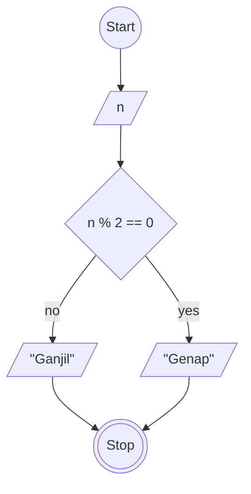

# Algoritma 2

## Menentukan Ganjil Genap

## Deskriptif

algoritma yang menentukan apakah angka tersebut ganjil atau genap

1. Mulai
2. masukan nilai bernama n untuk menampung suatu nilai/bilangan
3. jika nilai n dimodulokan 2 sama dengan 0 maka outputkan genap
4. jika tidak maka outputkan ganjil
5. Selesai

## Flowchart

membuat flowchart sebuah algoritma yang menentukan apakah angka tersebut ganjil atau genap



## Pseudo-code

```pseudo
DECLARE n: INTEGER

INPUT n

IF n % 2 == 0 THEN
    OUTPUT "Genap"
ELSE
    OUTPUT "Ganjil"
ENDIF
```
