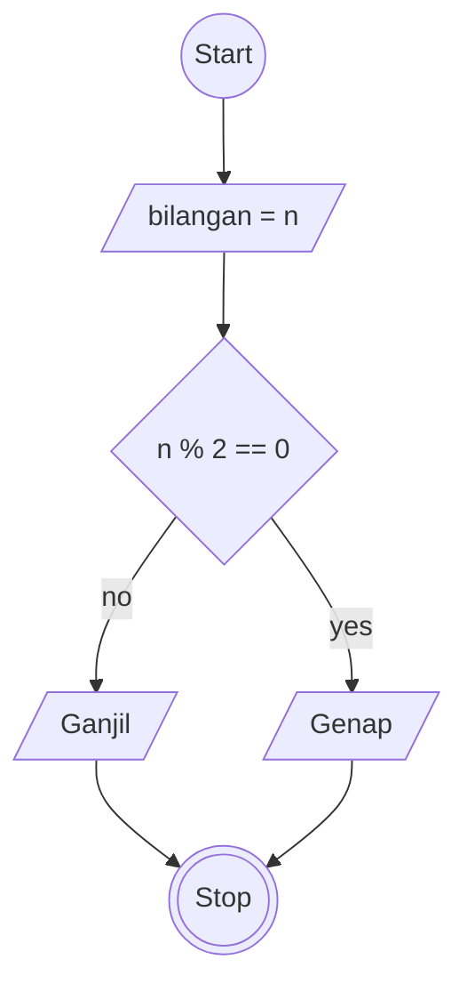

# Algoritma 2

## Menentukan Ganjil Genap

## Deskriptif

algoritma yang menentukan apakah angka tersebut ganjil atau genap

1. Mulai
2. Buat variable bernama n untuk menampung suatu nilai/bilangan
3. Selanjutnya buat kondisi untuk menentukan apakah nilai/bilangan tersebut genap dengan cara apakah n dapat habis dibagi dengan 2
4. Selanjutnya jika nilai/angka tersebut tidak dapat habis di bagi dengan 2 maka angka tersebut adalah bilangan ganjil
5. Selesai

## Flowchart

membuat flowchart sebuah algoritma yang menentukan apakah angka tersebut ganjil atau genap

