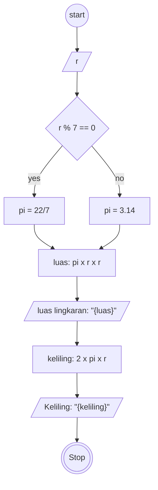

# Algoritma

# Luas dan Keliling Lingkaran

Algoritma menghitung luas dan keliling lingkaran

1. Mulai
2. tentukan nilai jari jari
3. untuk mengetahui nilai pi tentukan apakah jari-jari dapat habis dibagi dengan 7 jika dapat habis dibagi dengan 7 maka pi bernilai 22/7 jika tidak maka pi bernilai 3.14
4. selanjutnya untuk mengetahui luas lingkaran didapat dengan rumus pi dikalikan dengan jari-jari lingkaran kuadrat
5. selanjutnya untuk mengetahui keliling lingkaran didapat dengan rumus dua dikalikan dengan pi dikalikan dengan pi dikalikan dengan jari-jari
6. selesai

## flowchart

membuat flowchart untuk program menghitung luas dan keliling lingkaran

