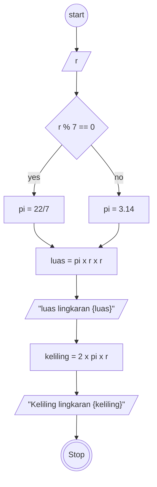

# Algoritma

# Luas dan Keliling Lingkaran

Algoritma menghitung luas dan keliling lingkaran

1. Mulai
2. masukan nilai ke dalam r untuk menampung nilai jari-jari
3. jika nilai r dimodulkan dengan 7 sama dengan nol maka gunakan nilai 22/7 untuk pi
4. jika tidak maka gunakan nilai 3.14 untuk pi
5. hitung luas dengan pi dikalikan r kuadrat
6. outputkan nilai dari luas lingkaran
7. hitung keliling dengan dua dikalikan dengan pi dikalikan dengan r
8. outputkan nilai dari keliling lingkaran
9. selesai

## flowchart

membuat flowchart untuk program menghitung luas dan keliling lingkaran



## PSEUDO-CODE

```pseudo code

DECLARE r: INTEGER
DECLARE pi: REAL
DECLARE luas: REAL
DECLARE keliling: REAL

INPUT r

IF r % 7 == 0 THEN
    pi = 22/7
ELSE
    pi = 3.14
ENDIF

luas <-- pi * r * r
OUTPUT "luas lingkaran", luas
keliling <-- 2 * pi * r
OUTPUT "keliling lingkaran", keliling


```
