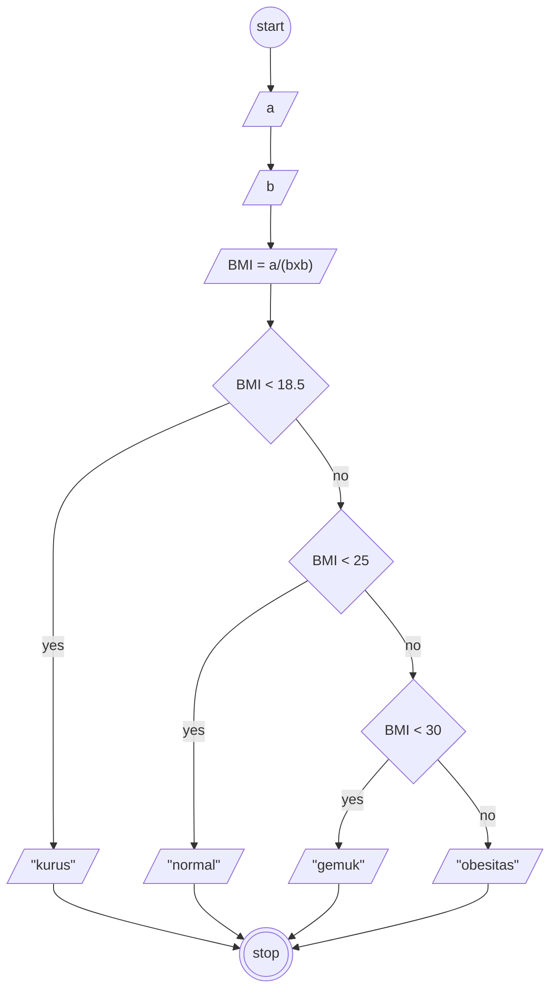

# Program Algoritma

## menghitung BMI (BODY MASS INDEX)

## Deskriptif Algoritma

1. Mulai
2. buat nilai a yang berisi nilai berat badan
3. buat nilai b yang berisi tinggi badan
4. Buat nilai BMI dengan cara berat badan dibagi (tinggi badan dikali tinggi badan)
5. jika BMI kurang dari 18.5 maka kurus
6. jika BMI kurang dari 25 maka normal
7. jika BMi kurang dari 30 maka gemuk
8. jika tidak semua maka obesitas
9. selesai

## Flowchart



## Pseudo-Code

```Pseudo-code
DECLARE a = REAL
DECLARE b = REAL
DECLARE BMI = REAL

INPUT a
INPUT b
BMI <- a / (b * b)

    IF bmi < 18.5 THEN
OUTPUT "KURUS"
    ELSE IF BMI <25 THEN
OUTPUT "NORMAL"
    ELSE IF BMI <30 THEN
OUTPUT "GEMUK"
    ELSE
OUTPUT "OBESITAS"
    ENDIF

```
